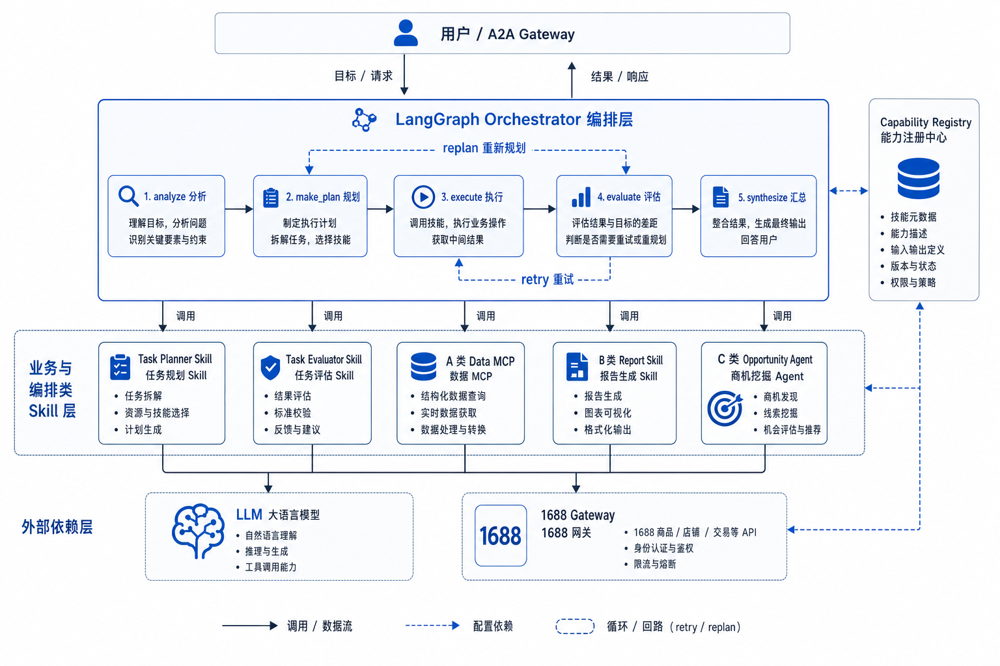
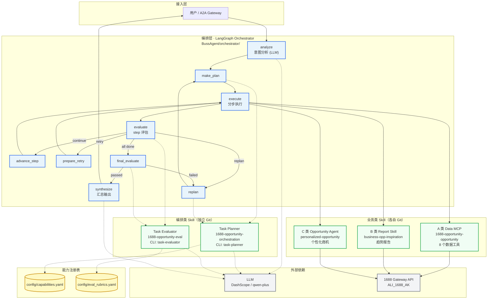

# 1688 商机 Agent 技术架构图

> 基于 [INTEGRATION_GUIDE.md](../INTEGRATION_GUIDE.md) 与编排层设计整理。  
> 核心思路：**LangGraph 编排骨架 + 独立 Skill 仓库 + 统一能力注册表**。

---

## 总览架构图



---

## Mermaid 源图（可编辑）



**图例**：
- **实线箭头**：运行时调用 / 数据流
- **虚线箭头**：配置依赖 / Skill 委托

---

## 系统分层（自上而下）

```text
┌─────────────────────────────────────────────────────────┐
│  用户 / A2A Gateway（未来）                               │
│  输入：自然语言 query                                     │
└───────────────────────────┬─────────────────────────────┘
                            │
┌───────────────────────────▼─────────────────────────────┐
│  编排层 Orchestrator（LangGraph StateGraph）               │
│  本地整合项目：BussAgent/orchestrator/                    │
│  职责：状态机、路由、调用各类 Skill、汇总结果              │
└───────┬───────────────┬───────────────┬─────────────────┘
        │               │               │
        ▼               ▼               ▼
┌──────────────┐ ┌──────────────┐ ┌──────────────────────┐
│ 编排类 Skill  │ │ 编排类 Skill  │ │  业务类 Skill         │
│ Task Planner │ │ Task Evaluator│ │  A / B / C 三类       │
│ (独立 Git)   │ │ (独立 Git)    │ │  (各自 Git 仓库)      │
└──────────────┘ └──────────────┘ └──────────────────────┘
        │               │               │
        └───────────────┴───────────────┘
                            │
                            ▼
┌─────────────────────────────────────────────────────────┐
│  外部依赖                                                 │
│  - LLM（DashScope / qwen-plus）                          │
│  - 1688 网关 AK（ALI_1688_AK）                           │
└─────────────────────────────────────────────────────────┘
```

---

## 编排层控制流

```text
用户 query
    │
    ▼
[analyze] ──► intent（required_tags、suggested_capabilities）
    │
    ▼
[make_plan] ──► Task Planner Skill ──► task_plan（steps[]）
    │
    ▼
[execute] ──► A/B/C 业务 Skill（按 capability_id 路由）
    │
    ▼
[evaluate] ──► Task Evaluator Skill（step 模式）
    │
    ├── continue ──► advance_step ──► execute（下一步）
    ├── retry    ──► prepare_retry ─► execute（重试）
    ├── replan   ──► replan ────────► Task Planner（replan 模式）
    └── 全部完成 ──► final_evaluate ─► Task Evaluator（final 模式）
                            │
              passed ──────► synthesize ──► 最终回答
              failed ──────► replan / mark_failed
```

---

## 仓库与部署关系

```text
                    ┌─────────────────────┐
                    │   BussAgent（本地）  │
                    │   完整整合 + E2E     │
                    └──────────┬──────────┘
                               │ 引用
         ┌─────────────────────┼─────────────────────┐
         ▼                     ▼                     ▼
┌─────────────────┐  ┌─────────────────┐  ┌─────────────────────┐
│ orchestration   │  │ eval            │  │ 业务 Skill 仓库群    │
│ task-planner    │  │ task-evaluator  │  │ opportunity (MCP)   │
│                 │  │                 │  │ inspiration (报告)  │
│                 │  │                 │  │ personalized (Agent)│
└─────────────────┘  └─────────────────┘  └─────────────────────┘
```

---

## 典型链路示例

**用户**：「分析帽子品类趋势并判断有没有商机」

| 步骤 | 节点 / Skill | 说明 |
|------|--------------|------|
| 1 | analyze | intent: required_tags=[report, trend, business] |
| 2 | task-planner | step_1: opp_cate_understand；step_2: business_opp_inspiration；step_3: personalized_opportunity |
| 3–4 | execute + evaluator | 类目理解 → passed |
| 5–6 | execute + evaluator | 生意灵感报告 → rubric 检查 |
| 7–8 | execute + evaluator | 个性化商机评分 → 阈值检查 |
| 9–10 | final_evaluate + synthesize | 终评 → 自然语言回答 |

---

## 关键状态字段

| 字段 | 含义 |
|------|------|
| `query` | 用户原始请求 |
| `intent` | 意图分析结果 |
| `task_plan` | 多步执行计划 |
| `current_step_idx` | 当前执行到第几步 |
| `step_results` | 每步执行结果 |
| `eval_history` | 评估历史 |
| `final_output` | 最终汇总输出 |
